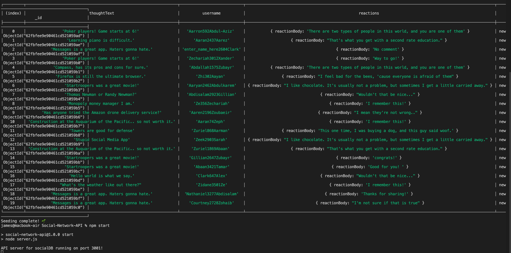
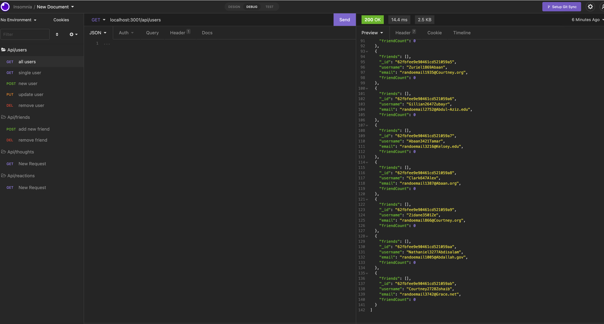
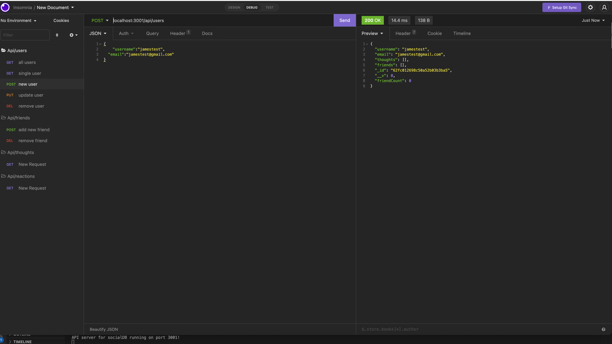

# Social-Network-API

- [Description](#description)
- [Installation](#installation)
- [Questions](#questions)
- [License](#license)

## Description

A backend for social meida api storing data with mongoose. This api allow you to view, add, update, and delete users. Also view, create, update, and delete thoughts for each user. It also allowed user to add, and delete friedns and react to user's thought.

## Installation

Clone the project and start with running the code `npm run install` followed by `npm run seed` to seed the user database. Finally, run `npm run start` to start the server locally. You will be able to access the api thorough application like Insomnia or Postman.

## Questions

Send me an email [here](mailto:james91055@gmail.com) to contact me directly.

## License

This project is licensed under the [MIT License](https://choosealicense.com/licenses/mit/) - click the link to read the license.

## Demo

[DemoVideo](https://www.loom.com/share/27d08dedf98a4767a33baa6726cced8e)

